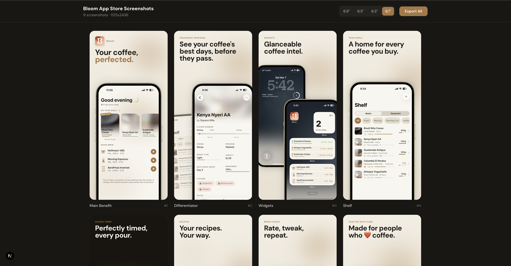

### NOTE: MAKE SURE TO USE 6.1 INCH simulator to capture starting screenshots
this will save u from adjusting the images later

# App Store Screenshots Generator (Safe)

A security-hardened skill for AI-powered coding agents (Claude Code, Cursor, Windsurf, etc.) that generates production-ready App Store screenshots for iOS apps. It scaffolds a Next.js project, designs advertisement-style screenshots, and exports them at all required Apple resolutions.



## Security Built In

This skill was built with security as a first-class concern:

| Protection | Details |
|------------|---------|
| **Pinned dependencies** | `next@15.1.0`, `html-to-image@1.11.13` — no `@latest` |
| **Input validation** | Color, font name, file path, and text content validated with regex + blocklists |
| **Path traversal prevention** | Rejects `..`, absolute paths, null bytes; image extensions only |
| **Injection prevention** | Blocks `url()`, `expression()`, `eval()`, `javascript:` in user values |
| **Font name allowlist** | Alphanumeric + space + hyphen only, max 60 chars |
| **No dangerous APIs** | `dangerouslySetInnerHTML`, `eval()`, `new Function()`, `fetch()` forbidden |
| **Scoped instructions** | "Additional instructions" limited to visual/design — cannot install packages, run commands, or access files outside project |
| **Filename sanitization** | Non-alphanumeric chars stripped from export filenames |

## What it does

- Asks you about your app's brand, features, and style preferences
- Scaffolds a minimal Next.js project (or works within an existing one)
- Designs each screenshot as an **advertisement** — not a UI showcase
- Writes compelling copy using proven App Store copywriting patterns
- Renders screenshots at full resolution with a built-in iPhone mockup
- Exports PNGs at all 4 Apple-required sizes (6.9", 6.5", 6.3", 6.1")

## Included assets

- `mockup.png` — Pre-measured iPhone frame with transparent screen area

## Install

### Using npx skills (project-scoped — recommended)

```bash
npx skills add ofirkris/app-store-screenshots-safe
```

This works with Claude Code, Cursor, Windsurf, OpenCode, Codex, and [40+ other agents](https://github.com/vercel-labs/skills#available-agents).

Install for a specific agent:

```bash
npx skills add ofirkris/app-store-screenshots-safe -a claude-code
```

### Global install (use with caution)

Global installation modifies your AI agent's behavior across **all projects and future sessions**. Prefer project-scoped installation.

```bash
npx skills add ofirkris/app-store-screenshots-safe -g
```

### Manual (git clone — project-scoped)

```bash
# Project-scoped (recommended)
git clone https://github.com/ofirkris/app-store-screenshots-safe .claude/skills/app-store-screenshots

# Global (affects all projects — use with caution)
git clone https://github.com/ofirkris/app-store-screenshots-safe ~/.claude/skills/app-store-screenshots
```

## Usage

Once installed, the skill triggers automatically when you ask your agent to:

- Build App Store screenshots
- Generate marketing screenshots for an iOS app
- Create exportable screenshot assets

Or just tell your agent what you need:

```
> Build App Store screenshots for my app
```

It will ask you about your app's screenshots, brand colors, font, features, style direction, and number of slides before building anything.

## What gets scaffolded

If starting from an empty folder, the skill creates:

```
project/
├── public/
│   ├── mockup.png          # iPhone frame (copied from skill)
│   ├── app-icon.png        # Your app icon
│   └── screenshots/        # Your app screenshots
├── src/app/
│   ├── layout.tsx          # Font setup
│   └── page.tsx            # Screenshot generator (single file)
├── package.json
└── ...
```

The entire generator is a **single `page.tsx` file**. Run the dev server, open the browser, click any screenshot to export it as a PNG.

## Export sizes

| Display | Resolution |
|---------|-----------|
| 6.9" | 1320 x 2868 |
| 6.5" | 1284 x 2778 |
| 6.3" | 1206 x 2622 |
| 6.1" | 1125 x 2436 |

Screenshots are designed at 1320x2868 (largest) and scaled down for smaller sizes.

## Tech stack

| Dependency | Version | Purpose |
|-----------|---------|---------|
| Next.js | 15.1.0 | Dev server + static image serving |
| TypeScript | (bundled) | Type safety |
| Tailwind CSS | (bundled) | Styling |
| html-to-image | 1.11.13 | PNG export at exact resolutions |
| React | (bundled) | Component composition |

## Key design principles

- **Screenshots are ads, not docs** — each slide sells one idea
- **Copy follows the "one second" rule** — readable at thumbnail size in the App Store
- **Layouts vary** — no two adjacent slides share the same phone placement
- **Style is user-driven** — no hardcoded colors, gradients, or fonts

## Requirements

- Node.js 18+
- One of: bun, pnpm, yarn, or npm (detected automatically, bun preferred)

## License

MIT
